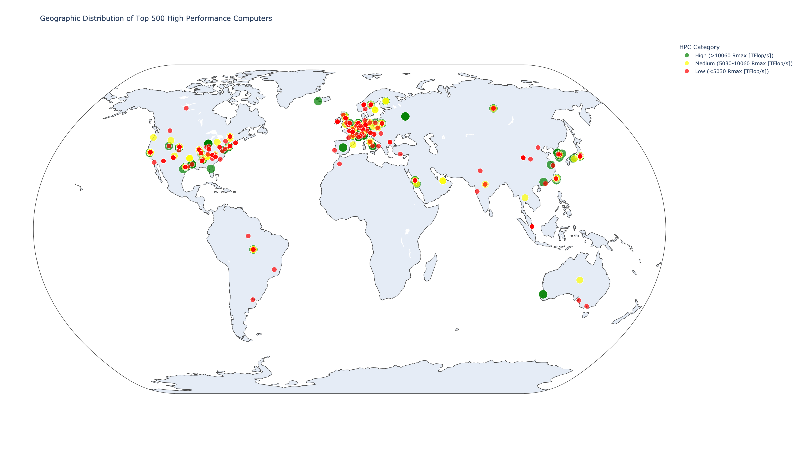

# HiMCM-15057
Contest resource &amp; files

task instructions: https://docs.google.com/document/d/1AImKrr2hzlnSyIuQDMBJ166XfQ1hpqFJXPZNgx61LLA/edit?usp=sharing

Some important csv files:

top500_HPCs.csv: Including world top 500 hpcs' Rank,Name,Site,Country,Computer,Year,Total Cores,Rmax [TFlop/s],Rpeak [TFlop/s],Latitude,Longitude.
  
task1:

HPC_Power.csv: Including total power consumption running at max TFLop/s and average power consumption of 195 HPCs.
  
task2:
    
energy1.csv: Listed the total power generation of 38 countries (countries with HPCs listed in top500_HPCs.csv) in 2023 and the power generation of different energy sources (bioenergy, coal, gas, hydropower, nuclear, oil, solar, and wind) and their share in the total power generation are listed.
    
CO2_emission.csv: Listed the amount of CO2 emission of electricity from energy sources (bioenergy, coal, gas, hydropower, nuclear, oil, solar, and wind) per kWh (gCO2e/kWh).

max_CO2_Emission_by_HPCs.csv: Listed the the amount of CO2 emission of the 195 HPCs in the HPC_Power.csv running at max TFLop/s per hour (gCO2e/h).

avg_CO2_Emission_by_HPCs.csv: Listed the the amount of CO2 emission of the 195 HPCs in the HPC_Power.csv running at average TFLop/s per hour (gCO2e/h).

Note: Average power consumption is calculated by total power consumption * U. U is dependent on the categories of HPCs, which U=0.7 if HPC is in Cat1, U=0.6 if HPC is in Cat2, U=0.5 if HPC is in Cat3.

    
    

